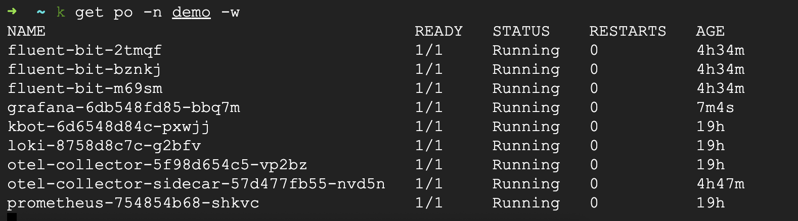
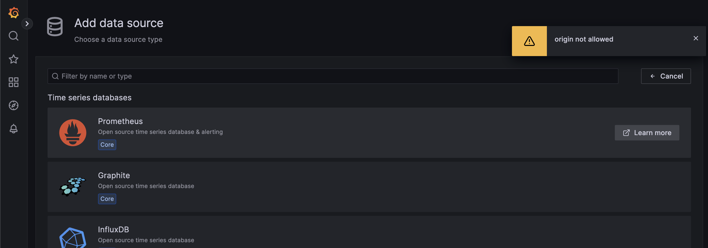

Розгорніть моніторинговий стек для вашого проєкту.

Компоненти:

OpenTelemetry
Prometheus
Fluentbit
Grafana Loki
Grafana

Оцінювання:

Стек розгорнуто та налаштовано у dev-середовищі в Kubernetes для власного проєкту за допомогою Flux. Otel розгорнуто оператором. Fluentbit збирає та експортує логи проєкту та усіх нод кластеру. Проєкт інструментовано для експорту метрик.

20 балів (principal): Проект інструментовано з наскрізним TraceID

____

- Розгорнуто K8S
- Розгорнуто Flux
    - OpenTelemetry
    - Prometheus
    - Fluentbit
    - Grafana Loki
    - Grafana

Далі не встиг...

**Error grafana datasource origin not allowed**

